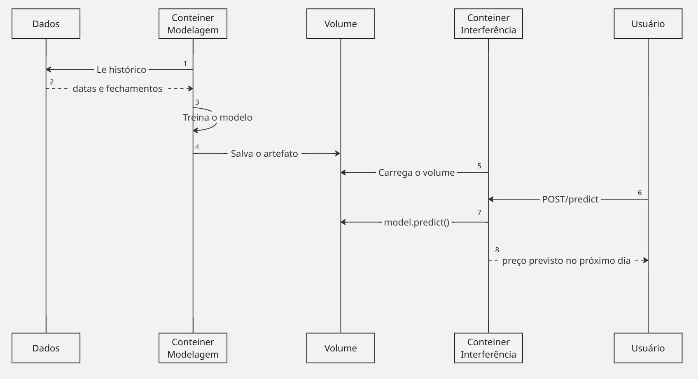

# Devlog Isabela Peçanha
Nesse arquivo descreverei o processo até o resultado final da criação de uma solução conteinerizada que treine um modelo para estimar o valor futuro de uma moeda, como o Bitcoin, a partir de dados históricos.

## Etapa 1 - Arquitetura
Comecei o meu desenvolvimento analisando o problema apresentado e realizando um diagrama UML. Comecei com algo bem simples mas efetivo para garantir que pelo menos estaria cobrindo todas as frentes da atividade. O resultado foi o seguinte diagrama UML:|

A solução é separada dentro de dois conteiners: um de treinamento e um de interferência que a norteiam. O conteiner de treinamento ve os dados do CSV e os usa para treinar o modelo e salvar a versão já treinada dele em um volume docker pronta para ser usada novamente. O conteiner de interferência por sua vez carrega esse volume e quando recebe a requisição POST/predict, roda o modelo e devolve para o usuário o valor da moeda no próximo dia. 

# Etapa 2 - Definição específica do escopo e construção dos dados
Moeda: BTC-USD
Quantos dias para frente? O dia seguinte, o bitcoin é uma moeda bem volátil e prever muito a frente talvez tornaria o modelo um pouco inútil após poucos dias.
Se a moeda é volátil porque por dia e não por hora? Os dados que consegui obter foram do yahoo fianance e eram de abertura e fechamento e portanto não conseguiria fazer uma predição por hora

Nessa etapa usei a IA para me ajudar a entender como usar a API do yahoo finance e desenvolver o código para a criação do CSV.
Além disso criei dentro de src duas pastas uma onde ficará o conteiner de treinamento e o outro onde ficará o conteiner de interferência, cada uma com um Dockerfile e um requiremtents.txt pronta para a criação das imagens e adição de código.

# Etapa 3 - Criação do modelo
Nessa etapa realizei o treinamento do modelo, o código foi produzido com a ajuda da IA para otmização de tempo.
O modelo decidido foi o de uma LSTM, já que essa, como estudamos em aula tem capacidade de entender os dados como um conjunto observando padrões de influência levando em consideração a passagem do tempo, muito útil para previsão de séries temporais como esta.
Nesse caso a LSTM usa os dados dos últimos 30 fechamentos do BTC-USD e prevê quanto o preço vai variar no dia seguinte. Essa escolha tem como objetivo ajudar o modelo a entender o formato do preço dessa moeda. Depois da saída a variação é convertida para o pr4eço em dolares e o dado devolvido ao usuário
Os dados são divididos em orderm cronológica com split de 80/20 paras treino e teste. Como método de avaliação principal uso o MAE comparado com o resultado de um naive. 
O modelo final é salvo em Pytorch, uma biblioteca python para criar e treinar redes neurais.  Essa biblioteca já tras um modelo de LSTM , calcula os gradientes automaticamente e é mais leve que tensor flow.
Nesse momento que comecei a pensar sobre as imagens dos conteiners. A imagem base que usei foi a do python 3.11, copiando o requirements, rodando o pip install e logo depois copiando o código em si do treinamento em train.py.

# Etapa 4 - Interferência do modelo
Nessa etapa que comecei a definir a parte de interferência da minha solução. Primeira coisa que se mostrou necessária foi a criação do backend em FASTapi, é ele que vai permitir que o usuário consiga fazer predições com o modelo. Nessa fase usei a IA para poder me auxiliar na produção do código do backend.
O bakcend funciona da seguinte forma: ao iniciar ele carrega o modelo LSTM que pegamos o modelo que está no volume modelo junto com seus metadados e a API roda a previsão do fechamento do dia seguinte usando os últimos 30 fehcamentos. A predição no backend realiza a mesma normalização do treino e o modelo devolve a variação esperada com o backend convertendo de volta o preço para dólares.

# Etapa 5 - Compose
Para realizar essa etapa usei a ajuda da IA para gerar o código do compose que vai subir os dois conteiners e garantir que esses possam se comunicar. Ele está definindo os dois serviços (os conteiners) e também o volume nomeado que garante o funcionamento da solução. Esse, executa todo o fluco de uma vez e possibilita o funcionamento da solução conteinerizada.

# Etapa 6 - Testes
O primeiro teste que fiz foi rodando o docker compose up --build e depois de uma pequena espera o conteiner fica pronto para que posssamos realizar as predições. O teste que faço é com o dia seguinte de hoje (05/10/2026) com o código **curl.exe -X POST http://localhost:8000/predict** e tenho como retorno **{"ultimo_fechamento":86480.3046875,"previsao_proximo_dia":86480.69}**. Com esse resultado posso perceber que o modelo está funcionando muito similar ao naive prevendo um resultado quase igual ao dia anterior. Algo que se alia a isso é que o erro do treino fica somente um pouco acima só do Naive: de 1033,47 para 1038,95.

# Como reproduzir
Só rodar o código: docker compose up --build  e aguardar até que carregue e depois fazer uma requisição usando curl podendo ser ela ou do /health (vê se tudo esta rodando corretamente) ou /predict retorando a previsão do dia seguinte. 

# Limitações
O desempenho do modelo não é muito bom sendo muito similar ao naive que só reproduz o último valor. 
